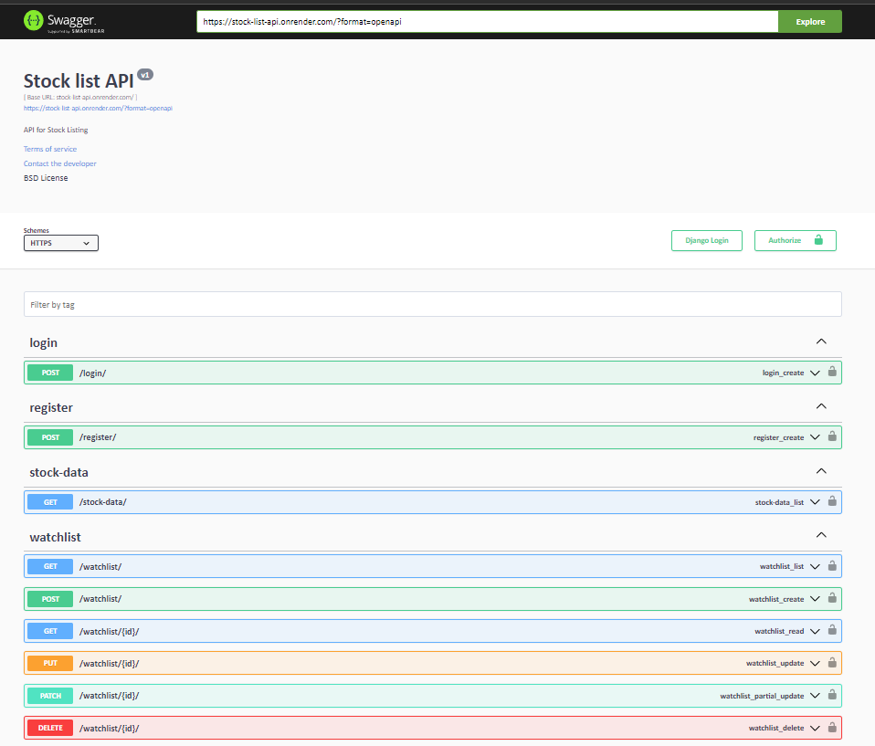
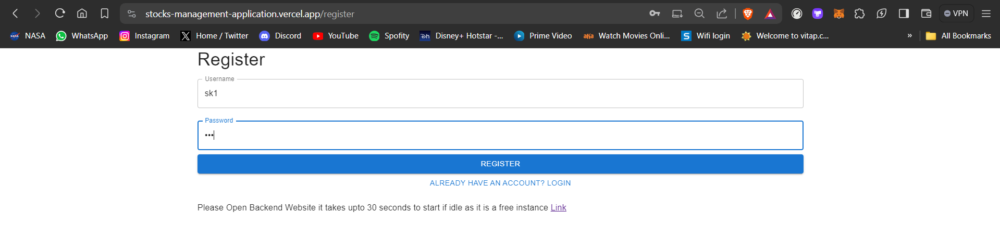
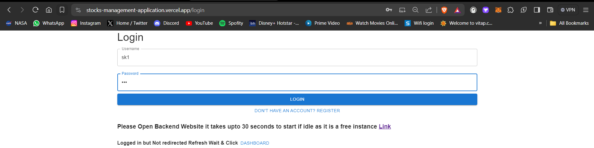
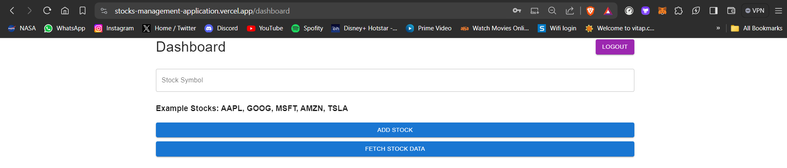
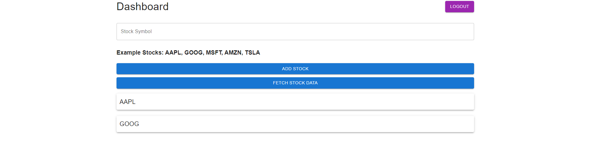

### Stock Monitoring Platform Documentation

### `Scroll to the end of the documentation for the deployment links`


#### Overview
This project aims to create a stock monitoring platform where users can log in and monitor stock information. The application consists of both frontend and backend components. The backend is developed using Django REST Framework with MySQL as the database, while the frontend is built with React using TypeScript and Material UI.

#### Technologies Used
- Django REST Framework
- React
- TypeScript
- Material UI
- MySQL

### Backend
The backend handles user authentication, watchlist management, and fetching stock data from an external API.

#### Authentication
The backend is secured with django restframework authorization token authentication.

#### Backend Endpoints
```python
# User Registration
POST /register/

# User Login
POST /login/

# View Watchlist
GET /watchlist/

# Add Stock to Watchlist
POST /watchlist/

# View Watchlist Detail
GET /watchlist/<int:pk>/

# Fetch Stock Data
GET /stock-data/
```

### Frontend
The frontend provides a user interface for registration, login, dashboard, and watchlist management. It interacts with the backend API to perform these actions.

#### Frontend Endpoints

```python
# Register User
/register

# User Login
/login

# Dashboard
/dashboard

# Dashboard (Redirect if not logged in)
/

# Watchlist Management
/dashboard

# Logout
/logout
```


### Running Application locally

#### Backend

Open the folder
```bash
cd stock_app
```

Install the required packages
```bash
pip install -r "requirements.txt"
```

Run the server

```bash
python manage.py runserver
```

If error occurs or it shows any `unapplied migrations` 

Create migrations and apply the migrations

```bash
python manage.py makemigrations
```

```bash
python manage.py migrate
```

Then try running the server again using `python manage.py runserver`


#### Front end

```bash
cd ..
```

```bash
cd stock-app-ui
```

```bash
npm install
```

```bash
npm start
```

## Deployment Link and things to know

# `As the backend of the application is deployed in a free tier if the application is idle it sleeps Before opening the Main application the backend application needs to start so please open this application until swagger documentation shows up it will take around 30 seconds to load so please wait then you can proceed with the frontend link.`


Backend deployment Link with Swagger Documentation

```bash
https://stock-list-api.onrender.com/
```

Frontend deployment Link

```bash
https://stocks-management-application.vercel.app/
```


#### Backend Swagger API Documentation



#### Register Page UI



```python
username = sk1
password = 123
```

#### Login Page UI



#### DashBoard before adding the stock names to the Watchlist



#### DashBoard after adding the stock names to the Watchlist

